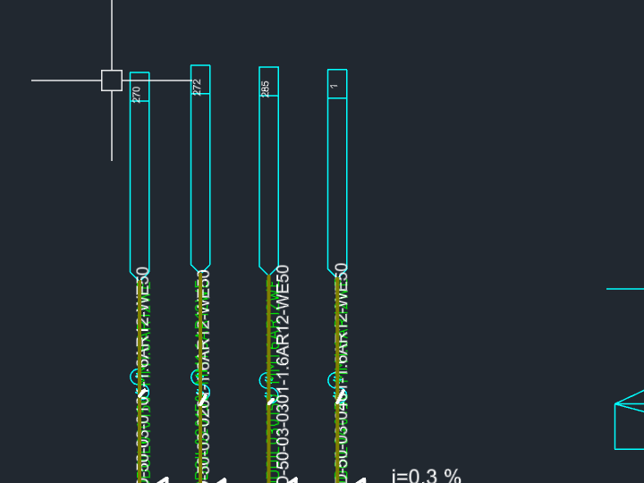
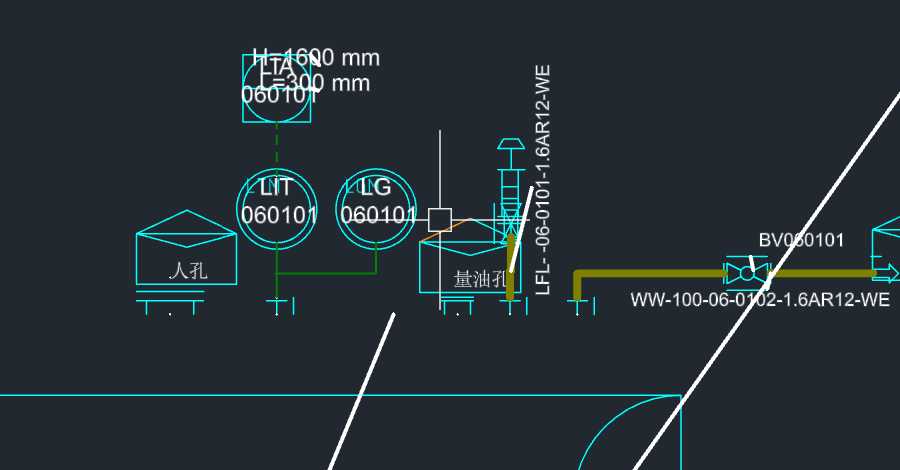
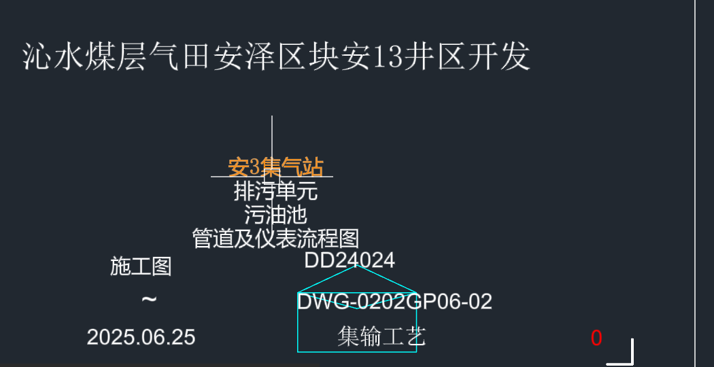
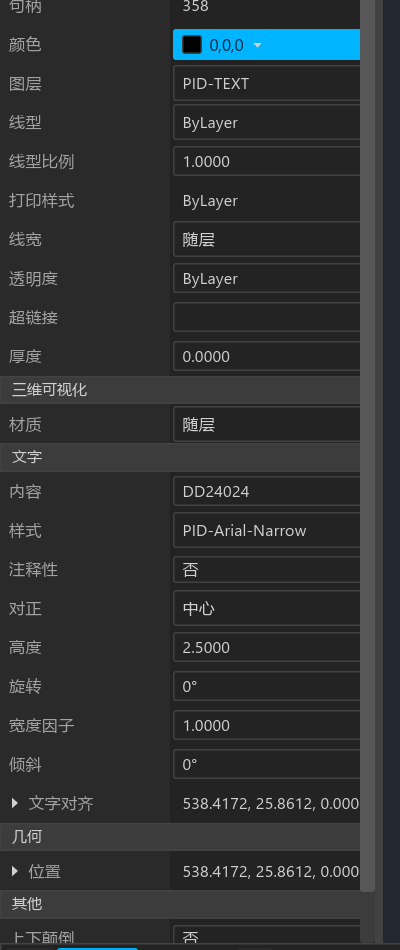
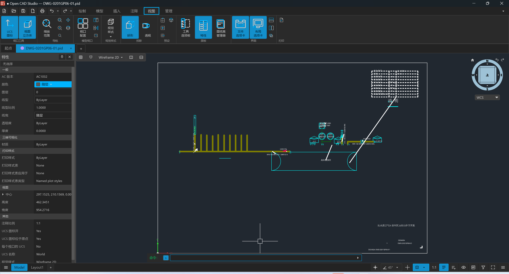
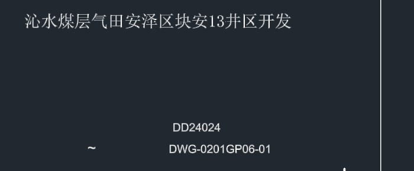
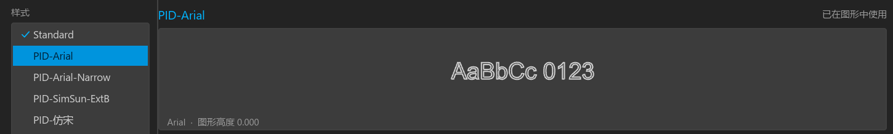
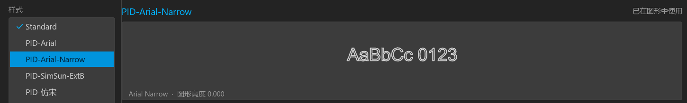
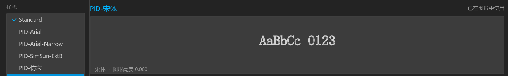

# 屏幕 vs 断言：六条提交的逐项核对

这六条提交全部靠单元与集成测试钉着，没有人把图渲染出来确认过。本文把两张图真的画在屏幕上，
逐项核对"屏幕表现"与"测试断言"是否一致。每一项只有三种结论：**一致 / 不一致 / 没看出来**。

## 0. 钉住的版本与环境

| 项 | 值 |
|---|---|
| pid-parse HEAD | `2a08664df752e3f1608af88a3c924091d716d4ec` |
| OpenCADStudio HEAD | `104890142c16e27f9865dd15beb72c657b1a135d` |
| 构建那一刻的工作区与 HEAD 的差异 | **仅** OpenCADStudio 的 `.gitignore` 多 6 行；`git status` 里其余 `M` 全是 CRLF/LF 换行噪声（`git diff --stat` 只列出 `.gitignore`）。pid-parse 是 path 依赖，其工作区当时对 HEAD 无内容差异。<br>写这份报告时再看，两个仓的工作区都已经被别人改动很多（OCS 344 个文件、pid-parse 的 `style_link.rs` 等），**但本文的二进制、测试与截图全部产自上面那一刻的树**，即等价于这两个 HEAD |
| 工具链 | `rustc 1.99.0-nightly (1a98b1e13 2026-08-07)` / `cargo 1.99.0-nightly (c79e8f894 2026-08-04)` |
| 构建 | `cargo build --bin OpenCADStudio --example pid_probe --example pid_plot_dump`（debug，`CARGO_TARGET_DIR=D:\Rust\target`） |
| 本机已装字体 | `Arial`、`Arial Narrow`、`SimSun-ExtB`、`宋体`、`仿宋` —— 导入器注册的五种字体在本机**全部存在**，所以任何"看起来一样"都不能推给缺字体 |

别人后续改动不影响本文结论：以上两个 HEAD 是本次核对的全部依据。

## 1. 断言侧先跑一遍（作为对照基线）

`cargo test --test pid_import`：**20 passed / 0 failed**（5.58s）。其中与这六条提交直接相关的五条
（`rotated_lettering_is_stored_in_radians`、`lettering_carries_the_colour_the_drawing_states`、
`lettering_starts_from_the_side_the_drawing_states`、`lettering_names_the_typeface_the_drawing_states`、
`lettering_carries_the_height_the_drawing_states`）全绿。

`pid_probe` 对两张图跑出的普查与任务给的实测参照逐项吻合：

- **DWG-0201GP06-01**：355 实体；图层 SYMBOL 123 / POINT 75 / GEOMETRY 63 / TEXT 48 / CONNECTIVITY 25 /
  SYMBOL-LABEL 20 / FRAME 1；8 种字高×旋转组合，其中 `rot=90deg` 共 5 条（1.50mm×2 + 2.50mm×3）；
  字体 Arial 21 / Arial Narrow 8 / 宋体 18 / 其余 4 条落默认。
- **DWG-0202GP06-01**：360 实体；`rot=90deg` 共 13 条（1.50mm×4 + 2.50mm×9），`rot=180deg` 1 条 ——
  正是 `rotated_lettering_is_stored_in_radians` 钉的两个桶。

## 2. 怎么把图渲染出来的

`docs/screenshots/capture.ps1` 指向 `D:\Rust\target\release\OpenCADStudio.exe`，本机没有 release 构建，
所以改用 debug 二进制，并把截图流程换成：SendInput 强制前台 → 滚轮定点缩放 → `CopyFromScreen`
按物理分辨率（2560×1379）抓屏。选中实体后读左侧「特性」面板，是本次最有价值的一条证据链 ——
它把**样式名、对正方式、颜色、旋转、文字对齐点**一次全摆在屏幕上。

命令行可用（空格等同回车，所以 `ZOOM` + `EXTENTS` 分两拍执行；`ZE` 会报"未知命令"）。

**卡过的地方**（见 §6，与这六条提交无关，但确实在挡路）：用 UI 自动化敲 `ZOOM WINDOW`、
或在窗口 restore/maximize 状态之间切换时，应用 panic 退出了三次。绕开办法是全程保持窗口最大化、
只用滚轮缩放、每一步动作前重新抢一次前台。

---

## 3. 逐项核对表

### 3.1 竖排标签是不是真的立着，而不是歪 116 度

| | |
|---|---|
| **断言说什么** | `rotated_lettering_is_stored_in_radians`：DWG-0202GP06-01 有 13 条 `rotation == FRAC_PI_2`、1 条 `== PI`，且任何桶都不许落在 `90.000`/`180.000` 上 |
| **屏幕上看到什么** | 0202 四条竖管上的管线号（`OD-50-03-0101-1.6AR12-WE50` 等）与管顶小编号（`270`/`272`/`285`/`1`）**全部正立，自下而上读**，与管线严格平行；0201 的 `LFL-06-0101-1.6AR12-WE`、`WW-100-06-0101-1.6AR12-N` 同样正立。没有任何一条呈 116 度斜置 |
| **结论** | **一致** |



### 3.2 那条 180 度的标签

| | |
|---|---|
| **断言说什么** | 同一条测试，`PI` 桶计数为 1 |
| **屏幕上看到什么** | 0202 图幅左上角的 `DWG-0202GP06-02` 完整倒置（字形上下颠倒且左右反序），正是 180 度而非 180 弧度 |
| **结论** | **一致** |


### 3.3 符号库的弧线修完之后有没有画歪

| | |
|---|---|
| **断言说什么** | 没有任何断言直接盯符号弧线。`0bb6545a` 只用文字旋转（`rotated_lettering_is_stored_in_radians`）间接覆盖了角度单位，而提交信息自陈"符号库的弧线和符号内标签一直是错的（57.3 倍）" |
| **屏幕上看到什么** | 0201 中部：两个仪表泡是**正圆**、外圈内圈同心；卧式容器两端是**规整的半圆封头**；人孔、量油孔、阀门、放空管等符号形状完整闭合，没有出现开口弧、超转弧或塌成直线的弧。0202 的电伴热、阻火器、污水池等符号同样正常 |
| **结论** | **一致**（弧线形状正确）。需要说明的是：这是"看上去对"，不是"逐弧比对过角度"——本轮没有可对照的参考图，也不许改代码去导出弧线角度清单 |



### 3.4 居中和右对齐的标签，是不是真落在它该在的位置，而不是掉到原点

| | |
|---|---|
| **断言说什么** | `lettering_starts_from_the_side_the_drawing_states`：`{center: 18, left: 28, right: 2}`，并钉"每条非左对齐标签都带 alignment point，左对齐的都不带" |
| **屏幕上看到什么** | 三处独立证据：<br>① **仪表泡内文字**：`LIT` / `060101` 两行宽度不同，却共享同一条竖直中轴，并且这条中轴就是泡的圆心 —— 左对齐会让两行左边缘对齐（`LIT` 短、`060101` 长会明显左顶），屏幕上不是这样。<br>② **0202 图签四行堆叠**（`安3集气站` / `排污单元` / `污油池` / `管道及仪表流程图`）：四行长度差一倍，居中轴完全重合。<br>③ **特性面板直读**：选中 `DD24024`，`对正 = 中心`，`文字对齐 = 538.4172, 25.8612`，`位置 = 538.4172, 25.8612` —— 对齐点存在且非零。<br>另外把图纸原点（图框左下角，世界 0,0）放大看过：**没有任何文字堆在那里** |
| **结论** | **一致** |





### 3.5 黑字在深色背景上有没有被 adapt_to_bg 正确翻成白

| | |
|---|---|
| **断言说什么** | `lettering_carries_the_colour_the_drawing_states`：PID-TEXT 上 `{#000000: 47, ByLayer: 1}` |
| **屏幕上看到什么** | 特性面板确认选中标签的**颜色色块是纯黑、值 `0,0,0`**（不是 ByLayer，也不是 `PID-TEXT` 图层那个 `Color::GREEN`，见 `src/io/pid.rs:192`），而它在屏幕上**渲染为白色**。`adapt_to_bg`（`src/scene/view/render.rs:2839`）对亮度 ≤0.5 的背景把纯黑翻白，与图纸自身黑色线条走同一条路。图上 PID-TEXT 的字整片都是白的，没有再出现成片的绿色标注 |
| **结论** | **一致**。<br>一点保留：那 1 条落回 ByLayer 的标签按理仍应是图层绿，本轮没有把它单独找出来指认；符号内部文字仍是 PID-SYMBOL 的青色，这是 `apply_text_colour` 有意不碰的范围 |

### 3.6 三种字体在屏幕上是不是真的不一样

这一项要拆成三小项，结论不同。

**(a) 宋体 vs Arial —— 一致**

选中 0202 大标题 `沁水煤层气田安泽区块安13井区开发`，特性面板 `样式 = PID-宋体`，屏幕上是**明确的衬线中文**
（`沁`、`田`、`区` 的横末端有明显顿角），连其中的阿拉伯数字 `13` 也是宋体的衬线字形；
同一张图签里的 `DD24024` / `DWG-0202GP06-02` / `2025.06.25` 则是干净的无衬线 Arial。
两种字面在同一屏上肉眼可分。



**(b) SimSun-ExtB —— 一致（但落到了回退字体，是预期行为）**

`施工图`（`样式 = PID-SimSun-ExtB`、高 2.5）和 `管道及仪表流程图`（同样式、高 2.54）在屏幕上是**无衬线**中文，
与 `PID-宋体` 的衬线标题明显不同。原因是 SimSun-ExtB 只覆盖 CJK 扩展 B 区，不含常用汉字，
渲染器按字符回退到系统无衬线中文字体。**这是解码正确 + 字体本身无该字形**，不是接线错误。

**(c) Arial vs Arial Narrow —— 不一致**

这是本轮唯一确凿的屏幕缺陷，两条独立证据：

*证据一：文字样式管理器的同一控件、同一串字、同一字号下的对比*

| 样式 | 样式脚注写的字体 | 预览 `AaBbCc 0123` 墨迹宽度 |
|---|---|---|
| `PID-Arial` | Arial | **233 px** |
| `PID-Arial-Narrow` | Arial Narrow | **233 px** |
| `PID-宋体` | 宋体 | 216 px |
| `PID-SimSun-ExtB` | SimSun-ExtB | 211 px |

同一控件能把 `宋体` 和 `SimSun-ExtB` 画出不同宽度，说明它确实按样式解析字体；
但 `Arial` 与 `Arial Narrow` **像素级完全相同**。用 GDI+ 实测本机真实字体，
`AaBbCc 0123` 的 Arial Narrow / Arial 宽度比是 **0.829**，若真用了窄体，这里应该是 **193 px**。





*证据二：视口里实测两条标签的字形宽高比*

| 标签 | 特性面板样式 | 字高 | 屏幕墨迹 | 实测 宽/高 | GDI 参考 Arial | GDI 参考 Arial Narrow |
|---|---|---|---|---|---|---|
| `DD24024` | **PID-Arial-Narrow** | 2.5000 | 131×23 px | **5.70** | 5.739 | 4.602 |
| `DN80` | PID-Arial | 3.1750 | 57×16 px | **3.56** | 3.398 | 2.727 |

`DD24024` 的样式是 Arial Narrow，实测宽高比却贴着 Arial 的 5.739（偏差 0.7%），离 Arial Narrow 的 4.602 差 24%。
（GDI 参考值是把同样两串字在本机 Arial / Arial Narrow 下渲染后，用同一套墨迹包围盒算法量出来的，
所以口径与屏幕测量一致。）

| | |
|---|---|
| **断言说什么** | `lettering_names_the_typeface_the_drawing_states`：注册五个样式、`true_type_font` 分别为 `Arial` / `Arial Narrow` / `SimSun-ExtB` / `仿宋` / `宋体`，`height == 0`；PID-TEXT 上引用 `{PID-Arial: 21, PID-Arial-Narrow: 8, PID-宋体: 18, Standard: 1}` |
| **屏幕上看到什么** | 样式名、字体名、`固定高度 0.000` 在样式管理器里都对；`对正/颜色/高度/旋转` 在特性面板里都对。但 `PID-Arial-Narrow` 的字**用 Arial 的字宽画出来** |
| **结论** | 宋体 **一致**；SimSun-ExtB **一致**；**Arial Narrow 不一致** |

### 3.7 顺带核对：字高

`lettering_carries_the_height_the_drawing_states` 钉的表在特性面板里能一条条对上（`DD24024` 2.5000、
`DN80` 3.1750、`管道及仪表流程图` 2.5400、大标题 3.5000），且样式的 `固定高度` 是 0.000 ——
正是 `10489014` 特意断言、否则会悄悄覆盖逐实体字高的那一格。**一致**。

---

## 4. 不一致项：复现与定层

### 4.1 Arial Narrow 按 Arial 的字宽渲染

> **已修复**，见 §8。下面保留当时的取证原文。

**怎么复现**

1. `cargo build --bin OpenCADStudio`
2. `OpenCADStudio.exe test-file\DWG-0202GP06-01.pid`
3. 命令行敲 `STYLE`，在样式列表里依次点 `PID-Arial` 和 `PID-Arial-Narrow`，
   看预览区 `AaBbCc 0123` —— 两者宽度完全一致（脚注字体名分别是 `Arial` 和 `Arial Narrow`）。
4. 或者在图签里点中 `DD24024`（特性面板会显示 `样式 = PID-Arial-Narrow`），量它的字形宽高比，
   得到 5.70，即 Arial 的比例。

**问题在哪一层：渲染层（字体解析），不是解码，也不是接线**

- 解码没问题：pid-parse 把 `JStyleTextChar +68/+70` 读成了字符串 `"Arial Narrow"`，测试直接钉了这个值。
- 接线没问题：`register_text_styles` 把 `true_type_font = "Arial Narrow"` 写进了文档样式表，
  样式管理器脚注和特性面板都原样显示出来了。
- 断在 `Face::resolve`（`src/scene/text/font_face.rs:55`）往下这一段：
  `sysfont::has_family` / `canonical_family_name` 最终都走 `face_id`（`src/scene/text/sysfont.rs:132`），
  它构造的是 `fontdb::Query { families: [Name(canonical)], ..Default::default() }` ——
  `Default` 带的是 `stretch: Stretch::Normal`。`Arial Narrow` 的 `usWidthClass` 是 Condensed，
  这条按默认 stretch 发出的查询是本轮最可疑的一处；究竟是 fontdb 在这里回落到了 Arial，
  还是后面 `ttf_glyph::glyph(&canonical, ch)` 又按 family 重解析了一次，本轮没有继续往下查
  （边界要求只读、不改代码，也不许写探针）。

**这条不影响正确性、只影响观感**：字宽偏宽会让长管线号比图纸原意占更多横向空间，
在密集区更容易与相邻图元压字。0201 有 8 条、0202 有 12 条标签受影响。

### 4.2 `examples/pid_plot_dump.rs` 没跟上弧度修复（工具层）

`0bb6545a` 改了 `src/io/pid.rs`、`tests/pid_import.rs`、`examples/pid_probe.rs`，
但**没动 `examples/pid_plot_dump.rs`** —— 而它正是这个仓自己"把 .pid 画出来看一眼"的管线
（`.plot/plot_pid_csv.py` 消费它的 CSV）。两处现在是错的：

1. `examples/pid_plot_dump.rs:70`：`let (from, to) = (a.start_angle.to_radians(), a.end_angle.to_radians());`
   —— 修复后 `Arc::start_angle` 已经是弧度，这里**又换算了一次**，把每段弧压成 1/57.3。
   实测：`pid_plot_dump DWG-0201GP06-01.pid PID-SYMBOL` 输出的第一条 `poly`（一段被采样成 49 点的弧）
   x 只跨 0.01、y 只跨 0.35，是一条肉眼看不出弧度的细丝。
2. `examples/pid_plot_dump.rs:108` 输出 `t.rotation` 原值，但文件头注释（第 11 行）写的是
   `text,x,y,height,rotation_deg` —— 修复前是度、现在是弧度，列名与单位都对不上了。

没有任何测试覆盖这个 example，所以它一路绿着坏掉。**建议交给改 `src/io/pid.rs` 的那位一并收尾。**

---

## 5. 一致项汇总

| 核对项 | 断言说什么 | 屏幕上看到什么 | 结论 |
|---|---|---|---|
| 竖排标签立不立 | 13 条 `FRAC_PI_2` | 管线号自下而上正立，与管平行 | 一致 |
| 倒置标签 | 1 条 `PI` | 左上角图号完整倒置 | 一致 |
| 符号库弧线 | 无直接断言 | 仪表泡正圆、容器封头规整半圆、符号闭合 | 一致 |
| 居中/右对齐落位 | center 18 / left 28 / right 2，非左必带对齐点 | 泡内两行共轴且轴过圆心；图签四行共轴；对齐点非零；原点无堆积 | 一致 |
| 黑字翻白 | `{#000000: 47, ByLayer: 1}` | 特性面板 `0,0,0`，屏幕上渲染为白，全图无绿字 | 一致 |
| 宋体 vs Arial | 样式表五条 | 衬线中文 vs 无衬线拉丁，肉眼可分 | 一致 |
| SimSun-ExtB | 同上 | 无衬线（字体无常用汉字，按字符回退），与宋体可分 | 一致 |
| **Arial vs Arial Narrow** | `true_type_font = "Arial Narrow"` | **同宽，窄体没生效**（§8 已修复） | **不一致** |
| 逐实体字高 / 样式固定高度 0 | 高度表 + `style.height == 0` | 特性面板逐条对上，样式固定高度 0.000 | 一致 |

---

## 6. 顺带发现（不属于这六条提交，报回来由指挥官安排）

1. **应用在 UI 操作下 panic 三次**，都是同一条：

   ```
   thread 'main' panicked at library/core/src/num/f32.rs:1605:
   min > max, or either was NaN. min = 200.0, max = 0.0
   ```

   触发场景：用 UI 自动化敲 `ZOOM WINDOW` 并喂坐标、以及窗口在 restore/maximize 之间切换时。
   `min = 200.0, max = 0.0` 像是某个面板宽度 clamp 在可用宽度为 0 时炸掉（`f32::clamp`）。
   与这六条提交无关，但它把本轮的渲染会话打断了三次。

2. **`.pid` 打开期间被独占锁定**：应用开着 `DWG-0201GP06-01.pid` 时，
   连 `Copy-Item` 都会报 `os error 33（另一个程序已锁定文件的一部分）`。
   对一个"只读导入、永不写回"的格式来说，独占锁偏紧了 —— 用户没法在开着图的同时把它拷走或改名。

3. **打开 `.pid` 会在源文件旁边留下自动保存与锁文件**。本轮跑完后 `pid-parse/test-file/` 下多出：

   ```
   .DWG-0202GP06-01.pid.ocs.lock
   DWG-0201GP06-01.pid.ocs-autosave.sv$
   DWG-0202GP06-01.pid.ocs-autosave.sv$
   ```

   `cc648d0b` 把"`.pid` 永不是写入目标"钉在了保存路径上，但自动保存和锁文件仍然写在源目录里；
   而且强杀进程后 `.ocs.lock` 会留成僵尸锁。这三个文件本轮已由我删除，工作区已复原。

4. **0202 有 2 条 Text 的插入点在图框外**（x = -10.5 和 -23.3，见 `pid_probe` 的 outlier 段）。
   两条都不在 PID-TEXT 上（`pid_plot_dump ... PID-TEXT` 里没有负 x 行），
   所以不影响本次四项文字属性的结论，但值得单独看一眼它们属于哪个符号。

---

## 7. 附：截图清单

| 文件 | 内容 |
|---|---|
| `shot-0201-full.png` | DWG-0201GP06-01 全图（缩放至范围，2560×1379） |
| `shot-0202-full.png` | DWG-0202GP06-01 全图 |
| `shot-0201-instruments.png` | 0201 中部：仪表泡（居中文字）、竖排管线号、符号弧线 |
| `shot-0201-titleblock.png` | 0201 图签：宋体标题 + Arial 编号 |
| `shot-0201-notes-table.png` | 0201 右上说明表：宋体行名 + Arial 单位 + 虚线线型 |
| `shot-0202-vertical-labels.png` | 0202 四条竖管的竖排标签 |
| `shot-0202-titleblock.png` | 0202 图签：四行居中堆叠 |
| `shot-0202-upside-down.png` | 0202 左上角 180° 倒置的图号 |
| `shot-0202-properties-dd24024.png` | 特性面板：颜色 0,0,0 / 样式 PID-Arial-Narrow / 对正 中心 / 对齐点非零 |
| `shot-style-arial.png` | 文字样式管理器：PID-Arial 预览 |
| `shot-style-arial-narrow.png` | 文字样式管理器：PID-Arial-Narrow 预览（与上一张同宽） |
| `shot-style-songti.png` | 文字样式管理器：PID-宋体 预览（可见不同） |

全程只读：除本文与上表这些截图外，两个仓没有新建或修改任何文件，也没有 git commit。

---

## 8. 后续：§4.1 的修复

§3.6(c) 量出来的那条不一致已经修掉。这一节记录岔路口定在哪、改了什么、修前修后的数各是多少。

### 8.1 岔路口：是 fontdb 回落，还是下游又解析了一次

**两个都不是。**丢在更前面一步：`sysfont` 自己的名字归一化。探针（在 `sysfont` 里临时加的
单元测试，取证后已删）打出来的原始事实：

```
--- Arial Narrow ---
  in families() list: false
  raw fontdb query -> None
  canonical_family_name -> Some("Arial")
  face_id -> families=[("Arial", …)] post="ArialMT" stretch=Normal
--- faces whose family or postscript name mentions 'narrow' ---
  families=[("Arial", …)] post="ArialNarrow"            stretch=Condensed
  families=[("Arial", …)] post="ArialNarrow-Bold"       stretch=Condensed
  families=[("Arial", …)] post="ArialNarrow-Italic"     stretch=Condensed
  families=[("Arial", …)] post="ArialNarrow-BoldItalic" stretch=Condensed
```

fontdb 给一张脸归档用的是**排印族名**（OpenType name ID 16），而 Arial Narrow 的 name ID 16
就是 `Arial` —— 四张窄体脸全部挂在 `Arial` 名下，只靠 `stretch = Condensed` 区分。所以：

- `db.query(Family::Name("Arial Narrow"))` 返回 `None`，**不是**回落到 Arial，是压根查不到；
- `canonical_family_name` 于是一路落到它的第 4 步「前缀／子串匹配」，`"arial narrow"` 以
  `"arial"` 开头，于是返回 `"Arial"`；
- 从那以后一切都是忠实的：`face_id`、`ttf_glyph::glyph`、cosmic-text 拿到的都是 `"Arial"`，
  各自都正确地画了 Arial。

### 8.2 改了什么

限 `src/scene/text/` 下两个文件：

- **`sysfont.rs`** —— 把族名索引表达不了的那些脸找回来。对 `stretch != Normal` 的脸重读一次
  name ID 1（旧族名，也就是 Windows 字体菜单里显示的 `Arial Narrow`），若它与 fontdb 归档用的
  排印族名不同，就登记成一条可按名解析的条目：同名多脸时（Narrow 的常规／粗／斜／粗斜四张都叫
  `Arial Narrow`）取正体常规那张。这些名字进 `families()`，所以选择器也能列出来；`face_id` 在
  族名索引查空之后才查它们，族名索引能答的一律不受影响。
  新增 `face_attributes(name) -> FaceRequest`，把「归档族名 + stretch/weight/style」一起交出去。
  只有非 Normal 宽度的脸会被重读 name table，本机是 600 多张脸里的 4 张。
- **`ttf_glyph.rs`** —— `build_shaped` 不再只给 cosmic-text 一个族名：
  `Attrs::new().family(Name(&face.family)).stretch(..).weight(..).style(..)`。普通字体的
  `face_attributes` 返回的就是 CSS 默认值，所以对它们是空操作。
  顺手修了同文件里一条既有的 clippy 提示（`map_or(false, …)` → `is_some_and`），因为验收要求
  改动文件零告警。

### 8.3 修前 / 修后 / 参照

屏幕上那条标签，`DD24024`（字高 2.5mm，特性面板样式 `PID-Arial-Narrow`），墨迹宽高比：

| | 宽高比 |
|---|---|
| 修前（本文 §3.6c 实测） | **5.70** |
| 修后（同一条标签，重新截屏实测） | **4.46** |
| 参照 · 本机真 Arial（GDI 同法量） | 5.739 |
| 参照 · 本机真 Arial Narrow（GDI 同法量） | 4.602 |

修后 4.46 与真窄体 4.602 相差 3%，来自墨迹高度只有 23~24 像素的量化误差（按 h=23 算是 4.65）；
与 Arial 的 5.739 差 22%，方向和量级都没有歧义。

同一件事在渲染器内部量一遍（回归测试打印的，`HXOnoe0123` 在 9 单位字高空间下）：

| | 宽高比 | 窄/常规 |
|---|---|---|
| 渲染器：Arial Narrow 6.567 vs Arial 8.007 | | **0.820** |
| GDI 参照：Arial Narrow 6.659 vs Arial 8.225 | | 0.810 |
| 修前：两者走同一张脸 | | 1.000 |

### 8.4 回归

`tests/text_width_variants.rs`。它做三件事：

1. **自己从字体文件算出该有哪些宽度变体**（扫 fontdb 的脸，挑 `stretch != Normal` 且
   name ID 1 与归档族名不同的），不去问 `sysfont` —— 否则一旦恢复逻辑坏掉，它会「找不到要检查的
   东西」然后静默变绿。
2. 对每一个变体，先断言解析结果（`Face::resolve` 必须落到 TTF 路径、`face_attributes` 报出来的
   stretch 必须是装机的那个），**再**做能力检查。顺序是特意的：第一版把能力检查放在前面，结果
   关掉修复后它以「这两张脸盖不住样本字」为由跳过，静默通过了。
3. 然后过 `lff::tessellate_text_ex`（视口用的同一个入口）量两条 run 的墨迹宽高比，要求窄体严格
   窄于常规体。

**验证过会变红**：把 `recover_hidden_faces` 改成直接返回空 `Vec`（等价于修复前的行为），测试报

```
assertion `left == right` failed: Arial Narrow resolved to a Normal face; the installed one is Condensed
  left: Normal
 right: Condensed
```

机器上没有宽度变体字体时，它打印 `SKIPPED: no width-variant font installed …` 并说明原因，不会
悄悄绿掉。

### 8.5 本轮验证

| 检查 | 结果 |
|---|---|
| `cargo test --test text_width_variants` | 1 passed（Arial Narrow、Bodoni MT Condensed 各量一遍） |
| `cargo test --test pid_import` | 22 passed / 0 failed |
| `cargo test --lib scene::text` | 25 passed / 0 failed |
| `cargo clippy --lib --tests` 在改动文件上 | 零告警 |
| `cargo fmt -- --check` 在改动文件上 | 没有新增排版漂移 |

排版那一行要说准：`sysfont.rs` 现在有 6 处漂移、`ttf_glyph.rs` 有 5 处，但把 HEAD 版本单独取出来
`rustfmt --check` 一遍，这 11 处一处不多一处不少地都在，只是行号被插进去的代码顶下去了 ——
5 处在没碰过的 `canonical_family_name_uncached` 里，1 处是文件末尾那个空行（HEAD 上就有），
`ttf_glyph.rs` 那 5 处也全在改动 hunk 之外。`git diff --check` 无输出。

GUI 复量用的是 fixture 拷到 `%TEMP%` 的副本，仓里的 `test-file/` 没有被打开、也没有留下锁文件或
自动保存文件。

### 8.6 收口前的独立复核

提交前由另一人把上面每一格重跑了一遍，用的是同一棵工作区树。结论：**§8.1–8.5 全部复现，无一条需要
按实测改写**。补充三点原文没写的：

1. **§8.4 的「关掉会变红」是真的**。把 `recover_hidden_faces` 改成直接返回空 `Vec` 后重跑，
   `tests/text_width_variants.rs` 报的就是 §8.4 抄的那段，一字不差：
   `Arial Narrow resolved to a Normal face; the installed one is Condensed`（left `Normal` /
   right `Condensed`），`0 passed; 1 failed`。验完已还原，`git diff --stat` 回到 216 + 19 行。
2. **同一次回滚下，`sysfont.rs` 里的单元测试 `a_recovered_name_resolves_to_its_own_face`
   照样是绿的** —— 它遍历的是 `fonts().recovered`，恢复逻辑一没了，它就「没有要检查的东西」，
   打一行 `SKIPPED:` 然后通过。这不是缺陷（它的 skip 会喊出来，而且 §8.4 那条集成测试正是为了
   不踩这个坑才自己从字体文件推 oracle），但**真正钉住这条修复的是
   `tests/text_width_variants.rs`，不是那个单元测试**，别把两者当同一道保险。
3. **`cargo test --lib` 整跑有 3 条红的**：`app::automation::tests` 下的
   `save_then_open_round_trips`、`start_page_runs_tools_that_need_no_drawing_but_still_refuses_the_rest`、
   `tilted_ucs_places_planar_entities_with_the_plane_normal`。把 `sysfont.rs` / `ttf_glyph.rs`
   两个文件临时退回 HEAD 再跑，**这 3 条照红**，所以与本修复无关，是 HEAD 上就有的。
   不属于本文范围，报回去另派。

`docs/analysis/` 之外只动了 `sysfont.rs` 一处过期的文档链接（`[`WidthVariant`]` 指向一个并不存在的
类型，实际叫 `Recovered`）。
