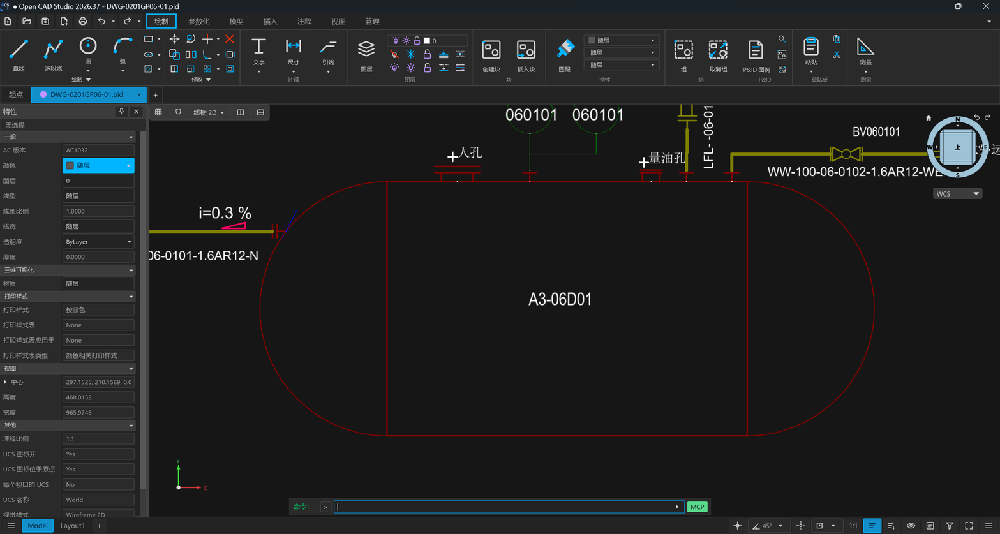
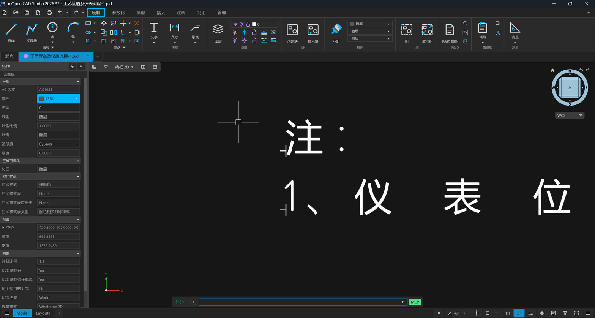
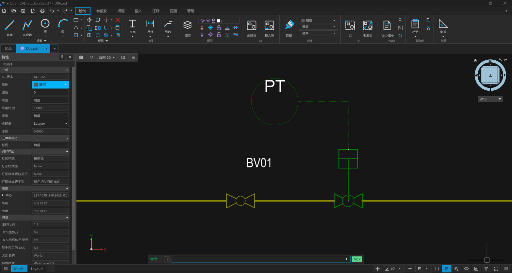

# 有缓存本体时优先画缓存 · 缓存 vs 库的显示优先级 · 开发计划（2026-09-19）

> 承接 pid-parse `docs/analysis/2026-09-07-placement-tail-names-the-cached-definition.md`「一处副产品：库读取器会多画一张 sheet」
> 与「还没做的：优先级：缓存 vs 库」（08-31 起的开口），以及 `2026-09-18-driving-dimensions-reach-the-panel-as-library-defaults.md`
> 结算段的第一条开口——K2 把「本体尺寸」按缓存实例量了出来，于是库在场时屏幕画的（库 `.sym` 的模板形，Manifold 228.6 × 40.64）
> 与面板说的（缓存实例，172.21 × 71.18）对不上，开口从此看得见。
> 现状：`pid.rs::build_entities` **先查库**（`discover_symbol_library` 从图纸目录向上找 `*symbol*` 目录，或 `PID_SYMBOL_LIBRARY`），
> 库没有本体才退回 `.pid` 自己缓存的那份（`NormalizedPidGeometry::symbol_definition(ref)`）；两条路都经 `shape_primitive` 放置、
> `apply_symbology` 按放置样式重涂，颜色线宽一致，**差的是形**。
> 事实基础：2026-09-19 会话里对五图逐放置比对（临时探针，未入库；数字见「背景」）；`0x00EC JFlavorManager` 一个符号一个、
> 它就是放置点名的 `JSite<jsite_ref>` 本人——**缓存里的是 SmartPlant 实际放置的那一个 flavor**（09-07 文档）；J3——四个参数化实例
> 的几何只在缓存里；L1——嵌套存储的图层显示状态 `SheetLayer::displayed` 已解开，缓存本体每个图元的 `sheet_layer_ref` 都能查到
> 它在哪层、那层开不开。
> 带 ⭕ 的决策按推荐落笔。**2026-09-19 14:09 用户在会话（fable-5-1-33）里批准**：八条全按推荐执行，未走 Plannotator；直接开 C1。
> **2026-09-19 C1 落地**：pid-parse `08fc95a` + `fec5d19`（同一会话）——`sheet_layers` / `primitive_layers` / `visible_primitives()`，
> 五图棘轮钉住（见 C1 进度）。**C2 落地**：OCS `641cec3b`（会话 fable-5-1-30，接手上一会话未提交的现场）——先缓存后库、关闭层不画、
> `OCS_PID_SYMBOL_SOURCE` 一轮、`extent=` 改量可见笔画；顺带裁出 **`igArc2d` 顺时针**（pid-parse `b6a70a7`），弧从此不再画成补弧；
> `pid_import` 54/54 × 四种环境组合（见 C2 进度）。**C3 收口**：双仓台账齐，本计划关闭；开口见「结算」。

## 决策记录

| # | 决策 | 结论 | 状态 |
|---|------|------|------|
| P-D1 | 谁先上屏幕 | **有缓存本体（非空）就画缓存，库只在缓存缺失或为空时用**——翻转现状。理由：缓存是 SmartPlant 放置的那个 flavor（`JFlavorManager`），语料 109 个放置 **109/109 有缓存**、库只有 97/109；两者都有的 97 个里 **仅 26 个逐图元相同**，其余 71 个不同的四类（见背景）里没有一类是「库对、缓存错」——库多画的是 `.sym` 的另一张 sheet、另一个修订版、或同名不同物；缓存独有的是四个参数化实例的实际几何。库仍是退路：站点自定义符号（工艺 `Xa*.sym` 12 个放置）今天已经只能靠缓存 | ⭕ |
| P-D2 | 缓存本体里处于**关闭图层**上的图元 | **不画**。缓存本体的图元各在符号内部的一层（`Default` / `Heat Trace` / `Jacket` / `Label` / `Construction` / `Dimension`），文件给每层一个显示位；`Heat Trace` / `Jacket` / `Label` / `Construction` / `Dimension` 在五图全部为关。SmartPlant 屏幕上看不见它们，OCS 也不画：伴热线、夹套线、`NULL` 占位文字、参数化本体的构造短线（Manifold 4 条、Drum 4 + 1 条）。**不**进 `PID-HIDDEN`、**不**进视图过滤器、**不**按同名图纸图层归层——符号内部层不是图纸图层，`Heat Trace` 是符号作者的分层，不是这张图的；跳过的数量进日志。库路径今天两类都画（`.sym` 读取器不带层），所以这一条是缓存优先带来的**净增保真**，不是补偿 | ⭕ |
| P-D3 | 要不要留旧行为的开关 | **留一轮**：环境变量 `OCS_PID_SYMBOL_SOURCE=library` 恢复「先库后缓存」，默认（未设 / 空 / 不认识）= `cache`；与 `OCS_PID_LAYER_MODE` 同款读法与日志；`pid_import` 两值都跑。下一轮若没人用就退役。备选「不留开关」：省一个环境变量，但 Remarks / Item Note & Label 那类注记符号在 工艺 / 0201 上形状变化很大，留一条回到旧图的路一轮，代价小 | ⭕ |
| P-D4 | 缓存本体里的文字 | 与图元同规则：在关闭层（`Label`）上的不画——语料里缓存本体的文字**全部**在关闭层上（按放置累计 0201 14 条 / 0202 22 / D06 2 / 工艺 42 / A01 0），内容是 `NULL` / `NULLNULL` 占位，外加 Drawing Description 那条 `说 明`（0201 / 0202 各 1）；`carries_a_label` 的过滤对开着的层上的文字继续适用（语料里没有）。库路径多画的 `LGM` / `LTM` / `PT` 字样随之不再出现——它们是 `.sym` 的模板字，SmartPlant 屏幕上的仪表位号来自图纸自己的文字记录，不是符号本体 | ⭕ |
| P-D5 | 样式 | 不变：`apply_symbology` 按放置样式重涂，两条路今天就都这样（调色板测试的四个类颜色全来自放置）。缓存存储自己的 `StyleCluster` 仍不接（09-07 开口，另议） | ⭕ |
| P-D6 | 变换 | 不变：缓存本体走同一个 `Placement::apply`（旋转 / 缩放 / 镜像）——K2 的 `extent=` 已经这样量，本轮之后画出来的与面板说的同一份几何 | ⭕ |
| P-D7 | 与 K2 `extent=` 的关系 | `PlacementMeasures` 改量**可见**图元（P-D2 同一过滤），画出来的与面板说的从此是同一份几何。语料里只有 **` Line2` 的数字变**：它的缓存本体是 `Default` 上一条 25.4 mm 的横线加 `Construction[OFF]` 上一条 3.81 mm 的竖向刻线（右端 x = 0.12705），K2 钉的 `25.40x3.81` 是把那条关闭层刻线也量了进去，改后为 **`25.40x0.00`**（一条线的外框，高 0）——K2 测试重钉并说明；Manifold（构造短线都在轮廓之内）、Tank、Black Box 不变。**C2 实测更正**：0201 二十个放置里 `extent=` 变的有 **11 个**，不止 ` Line2`——预估只看了四个参数化本体，而非参数化本体的伴热 / 夹套线、量表 7.57 mm 外圈、法兰短管的关闭层笔画同样伸出可见轮廓之外（Ball Valve Type 2 `8.89x6.35 → 8.89x3.81`、LG / LT 量表 `15.14x15.14 → 12.70x12.70`、Flanged Nozzle ×3 `5.08x3.18 → 3.81x2.54`、Flanged Nozzle with blind、Cap、jinchuzhan2、flame arrester breather valve）；口径不变（可见笔画就是屏幕上的），名单钉在 `the_two_symbol_sources_differ_only_in_the_body_drawn` | ⭕ |
| P-D8 | 没有 SmartPlant 截图怎么裁 | 09-07 文档说「要拿 SmartPlant 截图裁 Ball Valve Type 1」。本计划**不等截图**：文件自身的证据（`JFlavorManager` 点名的就是缓存、显示位说明哪些不显示）已经够裁；截图若有，作 C2 的手工验收补充（Ball Valve Type 1 / Remarks / Item Note & Label 三例），有出入则回到 P-D3 的开关并登记 | ⭕ |

## 背景

### 语料：两条路画出来的不一样（2026-09-19 逐放置比对）

| 图 | 放置 | 有库本体 | 有缓存本体 | 两者皆有且逐图元相同 | 图元数：今天（库优先）→ 缓存全部 → 缓存仅可见 |
|---|---|---|---|---|---|
| 0201 | 20（9 个带旋转） | 20 | 20 | 9 | 132 → 112 → **81** |
| 0202 | 23（13 个带旋转） | 23 | 23 | 6 | 194 → 146 → **120** |
| D06 | 6 | 6 | 6 | 2 | 48 → 40 → **32** |
| 工艺 | 58（8 个带旋转） | 46 | 58 | 8 | 679 → 287 → **237** |
| A01 | 2 | 2 | 2 | 1 | 8 → 12 → **6** |

语料无一放置带非 1 缩放。不同的 71 个分四类：

1. **库多画**（`.sym` 合并了所有 `Sheet*`，或库里是另一个修订版）：D06 Ball Valve Type 1（库 13 线 2 圆 vs 缓存 9 线 1 圆——
   09-07 文档那张 `/Sheet245`）、2 Way Ball Type 1（9 vs 7 线）、0201 flame arrester breather valve（22 vs 14 线）、
   0202 ElecTraceLine ×6（8 vs 4 线）、arrester breather valve(RD)（29 vs 21 线）。外框相同、多出的是内部笔画。
2. **同名不同物**（库里的 `.sym` 与图纸放置的根本不是一个形）：**工艺 Remarks ×35**——库 5 线 8 弧 1 圆 27.21 × 23.13 mm 的云线，
   缓存 3 线 1.27 × 1.27 mm 的小标记 + 一条 `Label[OFF]` 文字；0201 / 0202 Item Note & Label ×7 与 line1.5——库 8 线 19.05 × 13.97
   的框，缓存 2 线 2.54 × 2.54 + 文字；Drawing Description ×2——库 22.67 × 0.63，缓存 2.54 × 2.54；工艺 Off-Drawing——
   库 6 线 44.00 × 4.00，缓存 5 线 45.72 × 5.08。这一类今天在屏幕上是**错形**，且 Remarks 一图 35 处。
3. **缓存是实例**（J3）：Parametric Manifold（库 4 线 2 弧 228.6 × 40.64；缓存 8 线 2 弧 172.21 × 71.18，其中 4 线 `Construction[OFF]`）、
   Cone Roof Parametric Tank（127.0 × 83.82 vs 122.12 × 82.84）、Parametric Black Box ×2（25.4 × 25.4 vs 126.63 × 90.77）、
   Horizontal Drum（208.28 × 40.64 vs 159.46 × 51.92）、` Line2`（库两线同 y，缓存一线 + 一条构造线）。
4. **只差文字**（笔画逐一相同）：0201 4 / 0202 5 / D06 1——库多一条 `LGM` / `LTM` / `PT` 模板字，或 `NULL` 占位的条数 / 顺序不同。

**库没有、缓存有**：工艺 `Xa.sym` ×3、`Xa chu.sym` ×6、`Xa Item Note & Label.sym` ×3（站点自定义符号，今天已走缓存）。
**缓存没有、库有**：语料里**没有**。

### 缓存本体的图元在哪些层上（L1 的显示位读出来的）

| 图 | 有关闭层图元的本体 | 关闭层图元数（按放置累计） | 出现的关闭层 |
|---|---|---|---|
| 0201 | 15 / 17 | 31 | `Heat Trace`、`Label`、`Jacket`、`Construction` |
| 0202 | 8 / 11 | 26 | `Heat Trace`、`Label` |
| D06 | 4 / 6 | 8 | `Heat Trace`、`Jacket`、`Label` |
| 工艺 | 4 / 7 | 50 | `Heat Trace`、`Label` |
| A01 | 2 / 2 | 6 | `Heat Trace`、`Construction`、`Dimension` |

`Default` 在五图全部为开；上述五个名字在五图全部为关。今天 `PidSymbolDefinition::primitives` 把开关两类混在一起给出、不带层——
所以**缓存优先必须先让 pid-parse 把层带出来**（C1），否则画缓存会把伴热线、夹套线、`NULL` 文字和构造短线一起画上去。

### OCS 现在有的

- `build_entities` 的 `SymbolInstance` 分支：`library.resolve(path)` → `place_primitive`（带 `.sym` 逐笔样式，随后被 `apply_symbology`
  重涂）；`None` 时 `embedded_body`（`Option<&[SymbolPrimitive]>`）→ `shape_primitive`；再没有则 1.5 mm 标记圆；`embedded_bodies_drawn`
  计数进 `report_import` 一行 info。
- K2 的 `PlacementMeasures::of` 已按缓存本体量 `extent=`；`symbol_label_anchor` 按**画出来的**本体挂标签。
- 按库本体钉数字的测试（C2 要重钉的清单）：`a_symbol_body_draws_in_the_style_its_placement_names`（四色调色板 11 / 28 / 29 / 52 与
  3 条内部文字）、`the_vessel_draws_in_its_placements_maroon_not_its_syms_black`（两条 188 mm 壳线）、
  `a_symbols_lettering_follows_its_placement_colour_not_its_syms`（库模板字的颜色）、`a_symbols_bspline_lip_reaches_the_drawing_from_either_body`、
  `a_symbol_authored_away_from_its_origin_lands_on_the_line_work_it_marks`（ElecTraceLine）、
  `a_placement_without_a_library_body_draws_the_body_the_drawing_carries`（两路不等的前提消失）、
  `a_symbol_name_is_lettered_beside_the_symbol_it_names`（标签挂点随本体变）、以及按图纸图层数实体的绝对数
  （`hidden_authored_layers_open_on_pid_hidden…` 的 11、`sheet_mode_switching…` 的 16 ——放置在隐藏图纸图层上时其全部笔画计入）。

## 目标

一句话：**打开 `.pid`，每个符号画的是这张图自己缓存的、SmartPlant 实际放置的那个本体，关闭层上的笔画不画；符号库只在文件没
缓存时补位——屏幕上的形、特性面板的「本体尺寸」、标签挂点从此是同一份几何。**

验收基线：pid-parse `cargo test --all-targets` / clippy `-D warnings` / fmt 全绿（现：`--lib` 1110、`parse_real_files` 131），golden 不变
（本族不发实体）；OCS `pid_import` 在 `OCS_PID_LAYER_MODE` 两值 × `OCS_PID_SYMBOL_SOURCE` 两值下全绿（现 51/51 × 2）；
`i18n` 目录守护全绿；不新增 DXF/DWG 往返差异。

---

## 工作项

### C1 · 缓存本体的图元带上层与显示位（pid-parse）

**现状**：`PidSymbolDefinition { reference, layers: Vec<u32>, primitives: Vec<SymbolPrimitive>, dimensions, variables, template }`——
`layers` 只有 oid，`primitives` 不知道各自在哪层。`JSiteNestedGeometry` 的每条记录都有 `sheet_layer_ref`；`doc.sheet_layers[site.path]`
有该存储每层的 `name` / `displayed`。

**改法**（加法，不改现有字段，OCS 在 C2 之前照旧编译）：
1. `PidSymbolDefinition` 加 `sheet_layers: Vec<PidSymbolSheetLayer { oid, name: Option<String>, displayed: Option<bool> }>`——本体
   `layers` 里每个 oid 一条，名字与显示位来自 `doc.sheet_layers[storage]`（查不到的 `name: None` / `displayed: None`）。
2. 加 `primitive_layers: Vec<u32>`——与 `primitives` **同长同序**（circles → arcs → lines → polylines → texts → bsplines 的组装顺序不变），
   每个图元所在层的 oid。
3. 加 `pub fn visible_primitives(&self) -> impl Iterator<Item = &SymbolPrimitive>`：`displayed != Some(false)` 的层上的图元
   （没有显示位的层按显示——与 L1 「文件没说就画」一致）。
4. 组装点在 `geometry.rs::embedded_symbol_definitions` 第一遍里，不新加解码器；schema 多字段重封。

**验收**：棘轮 `a_cached_body_says_which_layer_each_stroke_is_on_and_which_are_hidden`：五图每个本体 `primitive_layers.len() ==
primitives.len()`、每个 oid 都在 `sheet_layers` 里、`sheet_layers` 的 oid 集合 == `layers`；被放置点名的本体里**有关闭层图元的**
恰 0201 15 / 0202 8 / D06 4 / 工艺 4 / A01 2；关闭层名字集合 ⊆ {`Heat Trace`, `Label`, `Jacket`, `Construction`, `Dimension`}，
`Default` 五图皆开；缓存本体的文字**全部**在关闭层上；Manifold 实例（396/113）`visible_primitives` = 4 线 2 弧、` Line2`（396/119）
= 1 线、D06 Ball Valve Type 1（145/125）= 6 线 1 圆、工艺 Remarks（7559/190）= 3 线。golden 不变、`--lib` / `parse_real_files` 只增不减。

**风险**：`displayed` 对嵌套存储的层是否全部解得到——L1 时按存储解的 `0x0057` 应覆盖 `/JSite*`；探针里五图所有出现的层都有位，
但棘轮要把 `None` 的层数钉成 0，出现再议。时间盒半个工作日。

**进度（2026-09-19，fable-5-1-33）**：pid-parse **`08fc95a`**（DTO + 棘轮）+ **`fec5d19`**（台账）。

- `PidSymbolDefinition` 加 `sheet_layers: Vec<PidSymbolSheetLayer { oid, name, displayed }>`（`layers` 每个 oid 一条、同序；名字与显示位
  来自该存储自己的层表与 `0x0057` 视图过滤集）、`primitive_layers`（与 `primitives` 同长同序）、`visible_primitives()`
  （`displayed != Some(false)` 的层上的图元）与 `layer_is_displayed(oid)`；加法，golden 不变，OCS 不改一行照旧编译。
- 语料：被放置点名的 43 个本体里 **33 个**带关闭层图元（0201 15/17、0202 8/11、D06 4/6、工艺 4/7、A01 2/2），只出现在
  `Heat Trace` / `Label` / `Jacket` / `Construction` / `Dimension`；缓存本体的文字全部在关闭层。按放置累计 整体 → 可见：0201 112 → 81、
  0202 146 → 120、D06 40 → 32、工艺 287 → 237、A01 12 → 6。Manifold 实例可见 4 线 2 弧、` Line2` 1 线、D06 Ball Valve Type 1 6 线 1 圆、
  工艺 Remarks 3 线。
- 风险项「没有显示位的层」**出现了但无害**：各缓存存储自己的基 sheet（JSheet 6）上的 `Default`（oid 8，没有 `0x0057` 集管它）与 A01
  OLE 站点 `/JSite204` 的两张 sheet——这些本体没有图元、也没有放置点名它们（0201 2 / 0202 1 / D06 2 / 工艺 2 / A01 4，钉住）。
  棘轮没把 `None` 的层数钉成 0，钉的是这份清单。

**验收结算**：棘轮 `a_cached_body_says_which_layer_each_stroke_is_on_and_which_are_hidden` 五图全钉；`parse_real_files` 131 → 132、
`--lib` 1110、golden 不变、fmt 干净。**clippy `-D warnings` 在 HEAD 上就红**：当天装的 nightly（rustc 1.100.0-nightly 2026-09-18）把
`map_unwrap_or` 扩到 `.map(f).unwrap_or_default()`，9 个文件 29 处旧代码中招，本项一处没碰——留一条清理提交（pid-parse task_plan 已记）。

### C2 · OCS 先画缓存、关闭层不画、库退为补位

**现状**：见「OCS 现在有的」。

**改法**：
1. `build_entities` 的 `SymbolInstance` 分支改序：`embedded_body`（改传 `Option<&PidSymbolDefinition>` 或直接传 `visible_primitives()`
   收集的切片）非空 → `shape_primitive` 放置；否则 `library.resolve(path)` → `place_primitive`；再否则标记圆。计数拆成
   `cache_bodies_drawn` / `library_bodies_drawn` / `hidden_strokes_skipped`（后者按放置累计），`report_import` 一行 info 改说三件事。
2. `OCS_PID_SYMBOL_SOURCE`：`cache`（默认）/ `library`（旧序）；读法、日志、不认识的值按默认——照 `OCS_PID_LAYER_MODE` 的
   `PidLayerMode` 写一个 `PidSymbolSource`，`load_pid_with_layer_mode` 旁加 `load_pid_with_options` 或在 mode 结构里并入，测试可注入。
3. `PlacementMeasures::of` 改量 `visible_primitives()`；`symbol_label_anchor` 不改（它量画出来的）。
4. 测试（`tests/pid_import.rs`）：
   - **新**：`a_placement_draws_the_body_the_drawing_carries_and_skips_its_hidden_layers`——0201 Manifold 的 `role=symbol` 实体恰 4 线 2 弧、
     两条壳线 **101.03 mm**（172.209 − 2 × 35.59）、弧 r 35.59；D06 Ball Valve Type 1 6 线 1 圆（r 1.27，无 r 1.59 的第二圈）；
     工艺 Remarks 每处 3 线、无弧无圆、无 `NULL` 文字；整图 `role=symbol` 实体里**没有** `NULL` 文字；每个放置画出的本体外框
     == 它的 `extent=`（用 `symbol-label` 的 `extent=` 与最近本体的 `drawn_box` 对；库在场与库缺失两种导入**相同**——
     `a_placement_without_a_library_body…` 的「两路不等」前提改成「两路相等」）；`OCS_PID_SYMBOL_SOURCE=library` 下回到旧数字。
   - **重钉**：调色板四色的条数（颜色种类不变、条数按缓存可见笔画重数）；`the_vessel…` 188 → 101.03；`a_symbols_lettering_follows…`
     的三条模板字不再存在——改钉「符号本体的可见文字数为 0、符号名标签仍在」或删；`a_symbols_bspline_lip…` 按缓存的 S1 钉；
     `a_symbol_authored_away…` 的 ElecTraceLine 4 线 2 弧；图纸图层绝对数（11 / 16）按新笔画数重钉并写明来源；K2 的
     `a_placement_states_its_extent…` 里 ` Line2` 的 `25.40x3.81` → `25.40x0.00`（P-D7）。
   - `the_two_layer_modes_agree_on_everything_but_the_slot` 不变（两图层模式下本体相同）；新加
     `the_two_symbol_sources_differ_only_in_the_body_drawn`——`role=` 非 `symbol` 的实体集合两值下相同。
5. `report_import` 与 `ImportSummary`：加 `cache_bodies` / `library_bodies` / `hidden_strokes_skipped` 三个数**只进日志**，命令行不加行
   （屏幕上形对了才是用户看得见的价值，不必再报一行）。

**验收**：上述测试全绿，四种环境组合各 5x/5x；手工：打开 0201 看 Manifold 是 172 × 71 的拉长罐、无轴线短线；打开 工艺 看 Remarks
是 35 个小标记而非云线；D06 球阀只有一圈；（有截图则对三例）。时间盒一个工作日。

**进度（2026-09-19，fable-5-1-30，接手 fable-5-1-33 的未提交现场）**：OCS **`641cec3b`**（代码 + 测试 + user-guide）；pid-parse **`b6a70a7`**（弧向）。

- `PidSymbolSource { Cache（默认）, Library }` + `SYMBOL_SOURCE_ENV = OCS_PID_SYMBOL_SOURCE`（读法 / 日志 / 不认识按默认，与 `PidLayerMode`
  同款）；`PidImportOptions { layer_mode, symbol_source }` + `load_pid_with_options`，`load_pid_with_layer_mode` 保留（source 仍读环境）。
- `build_entities` 的 `SymbolInstance` 分支改序：`cached_body_entities`（`source.strokes(body)`：Cache 下 `visible_primitives()`、Library 下
  整个本体）→ `library_body_entities` → 标记圆；Library 下反序。三样东西装进 `BodySources { cached, library, source }` 一个参数进去。
  计数 `SymbolBodies { cache, library, markers, hidden_strokes_skipped }`，`report_import` 一行 info 说三件事；「没找到库」由 warn 降为
  info（库只是补位），标记圆有专门一行 warn。`ImportSummary` 加 `cache_bodies` / `library_bodies` / `hidden_strokes_skipped`，只进日志，
  命令行不加行。
- `PlacementMeasures::of` 改量 `source.strokes(body)`——屏幕上的与面板说的是同一份笔画。
- **弧向**（计划外，C2 途中露出）：缓存 Manifold 实例画上屏幕后端帽向内、`extent=` 从 172.21 掉到 101.03——`igArc2d` 的两个角是绝对角
  没错，但弧从 `start` **顺时针**走到 `end`，`symbol_library.rs` 注释里的「逆时针」是假设。本体自己的 `Construction[OFF]` 轴线指向
  顺时针顶点、`Remarks.sym` 云线凸弧朝外，三处一致；尾字节 `+58` 不是方向位。pid-parse `b6a70a7`：改注释（字段值不动）+ 棘轮
  `a_cached_arc_sweeps_clockwise_from_its_start_angle_to_its_end_angle`（`parse_real_files` 132 → 133）+ 分析文档
  `2026-09-19-igarc2d-sweeps-clockwise-from-start-to-end.md`；OCS `shape_primitive` 对调两角（镜像放置反过来，落回文件原序）、图纸自身
  `PidGraphicKind::Arc` 同样对调（语料零条，按同一记录同一读法）。此前库画的 Manifold 模板（228.6 × 40.64）两端帽也是凹口——没人看出来
  是因为它从没和任何逐数钉住的外框对过。
- 测试（`tests/pid_import.rs` 51 → 54）：**新** `the_symbol_source_defaults_to_the_cache_and_names_its_two_sources`；
  `a_placement_draws_the_body_the_drawing_carries_and_skips_its_hidden_layers`（四图 `role=symbol` 实体恰 **81 / 120 / 32 / 237**、标签
  20 / 23 / 6 / 58、无文字无标记圆、摘要三数 (放置数, 0, 31 / 26 / 8 / 50)；Manifold 4 线 2 弧、71.18 × 2 + 101.03 × 2、弧 r 35.59 且
  中点在壳外、外框 `172.21x71.18` == `extent=`；D06 Tank 6 线 `122.12x82.84`、圆半径恰 [1.27, 1.59, 6.35]；工艺 Remarks 35 处、符号层无弧）；
  `the_two_symbol_sources_differ_only_in_the_body_drawn`（非 symbol 实体两值下逐个相同、标签与 `driving=` 相同、`extent=` 差 11 个的名单、
  81 vs 123、摘要 (20, 0, 31) / (0, 20, 0)、库下 188 mm 两条与 `LGM` / `LTM` / `说 明`）。**重钉**：调色板 11 / 28 / 29 / 52 →
  **9 / 9 / 25 / 38**、内部文字 3 → 0；`the_vessel…` 188 → **101.03**；`a_symbols_lettering_follows…` 改在 library 源上钉颜色 + cache 下
  符号层零文字、标签仍在；`a_symbols_bspline_lip…` 两路在 library 源下比、再钉 cache 画出同一条 S1；`a_placement_without_a_library_body…`
  改为「有库无库**相同**」（圆半径 [1.27, 1.59, 6.35]、笔画集合相等）+ library 源下旧数字 [1.27, 1.59, 1.59, 6.35, 7.57] /
  [1.27, 1.59, 6.35, 7.57]；K2 ` Line2` `25.40x3.81` → `25.40x0.00`。**不用动**：图纸图层绝对数 11 / 16（隐藏图纸图层上没有符号放置）、
  ElecTraceLine 落在管线上、标签挂点、`the_two_layer_modes_agree…`。`pid.rs` 单测 `the_source_decides_which_cached_strokes_are_drawn`、
  `a_bodys_arc_is_drawn_as_the_counter_clockwise_arc_over_the_same_points`。测试里加 `SUMMARY_MAILBOX` 互斥：摘要邮箱按路径键、后写覆盖，
  三个读摘要的测试串行（同图另一源的并行导入恰在「导入完 → 取走」的微秒窗口里落地的概率极小，未另做隔离）。

**验收结算**：`pid_import` **54/54 × 四种组合**（`OCS_PID_LAYER_MODE` ∈ {taxonomy, sheet} × `OCS_PID_SYMBOL_SOURCE` ∈ {cache, library}）；
`--lib` 的 `io::pid::tests` 8/8、`i18n` 目录守护全绿（本轮无新词条）；`pid.rs` rustfmt 干净、`pid_import.rs` 只剩 HEAD 就有的那一处
（123 → 174 行，同一 hunk）；`clippy --lib --test pid_import` 两文件零告警。`--lib` 全跑 1154 通过、3 失败——`pidlegend::an_svg_plot_groups…`
（`MissingGlyphs`，字体）、`plugin_manager::certificate_errors…`（系统语言中文）、`svg_export::a_page_style_table…`——三处都不碰 `io::pid`，
是环境，未在 HEAD 上复跑。**手工验收（2026-09-20 00:30，debug 版 GUI，`641cec3b`）**：打开 0201，A3-06D01 是 172 × 71 的拉长罐，两端帽
向外凸、罐内没有轴线短线，顶上三个法兰短管 / 人孔 / 量油孔与 LG / LT 量表都在；打开 工艺，`注：` / `1、仪表位…` 每行行首是一个 1.27 mm
的三线小标记，全图没有云线；打开 D06，Ball Valve Type 1 只有一圈 r 1.27、2 Way Ball 一圈 r 1.59、PT 气泡一圈 r 6.35，没有 7.57 的外圈。
同一份导入的 `--export` DXF 对数：D06 全图恰三个圆（1.27 / 1.59 / 6.35），0201 两条 r 35.59 的端帽弧 `90° → 270°` / `270° → 90°`
分别在壳体左右两侧向外。六张截图与对数留档在 [`docs/evidence/2026-09-20-cached-body-gui-check/`](../evidence/2026-09-20-cached-body-gui-check/README.md)：

SmartPlant 截图仍没有（P-D8）。

### C3 · 台账（双仓）

- user-guide `.pid` 一节：「符号从哪来」一段——先缓存后库、关闭层不画、`OCS_PID_SYMBOL_SOURCE` 一句；「符号的两个尺寸」段末
  那句「与屏幕上画的库本体可能不一致」删掉。
- pid-parse CHANGELOG（C1）、guide 嵌套存储一节补「图元带层与显示位」、`task_plan.md` 指针；09-07 placement-tail 文档「还没做的」
  第一条标已裁（本计划）。
- 本计划头部补记 + 进度 + 结算；2026-09-18 计划结算段第一条开口标已排入本计划。
- `remember`：缓存优先、关闭层不画、开关名。

**进度（2026-09-19，fable-5-1-30）**：user-guide「符号库」段改成「符号从哪来」（先缓存后库、关闭层不画、`OCS_PID_SYMBOL_SOURCE=library`
一轮、日志一行），「符号的两个尺寸」的括号改说「量的就是屏幕上画出的那些笔画」（随 `641cec3b`）；那句「与屏幕上画的库本体可能不一致」K2 时
就没写进 guide，无可删。pid-parse：CHANGELOG（C1 `fec5d19`、弧向 `b6a70a7`）、guide §5 嵌套存储一节「图元带层与显示位」（`fec5d19`）+
`igArc2d` 布局注（`b6a70a7`）、`task_plan.md` 指针、09-07 placement-tail 文档「还没做的」第一条标已裁（`b6a70a7`）。本计划头部 /
P-D7 更正 / 三项进度 / 结算 / 门禁记录（本提交）；2026-09-18 计划结算段第一条开口由「待门禁」改「已落地」（本提交）；`remember`
`mem-99`（缓存优先、关闭层不画、开关名、`extent=` 量可见笔画）与 `mem-101`（`igArc2d` 顺时针及其判据）。

---

## 结算（2026-09-19）

**三项齐。** 目标那句话兑现到什么程度：打开 0201，Manifold 是 172.21 × 71.18 的拉长罐、两端帽向外凸、没有轴线短线；打开工艺，35 处
Remarks 是 1.27 mm 的小标记而不是 27 mm 的云线；D06 球阀只有一圈；符号层上一个 `NULL` 也没有；每个放置画出的外框就是面板「本体尺寸」
说的那个数——同一份几何。库只在文件没缓存时补位（语料里没有这样的放置）；`OCS_PID_SYMBOL_SOURCE=library` 回到旧图一轮。

| 项 | 提交 | 验收 |
|---|---|---|
| C1 | pid-parse `08fc95a` + `fec5d19` | 五图棘轮；`parse_real_files` 131 → 132、`--lib` 1110、golden 不变、fmt 干净 |
| C2 | OCS `641cec3b`；pid-parse `b6a70a7`（弧向） | `pid_import` 54/54 × 四种组合；四图 81 / 120 / 32 / 237 逐数；`extent=` == 画出的外框；弧向棘轮 `parse_real_files` 132 → 133；GUI 手工三例（[`docs/evidence/2026-09-20-cached-body-gui-check/`](../evidence/2026-09-20-cached-body-gui-check/README.md)） |
| C3 | 本提交 + 上列 | 双仓台账齐 |

**与计划字面不同的三处**（都已写进各项进度）：P-D7 `extent=` 变的是 0201 的 11 个放置而不只 ` Line2`；`igArc2d` 弧向是计划外的发现，
pid-parse 多一条提交、OCS 对调两角；C1 风险项「没有显示位的层」出现了，但只在没有图元、无人点名的本体上。

**本轮之后还开着的：**

- `OCS_PID_SYMBOL_SOURCE=library` 的退役（下一轮没人用就删；连带 `a_placement_without_a_library_body…` 后半段、
  `the_two_symbol_sources_differ…`、`a_symbols_lettering_follows…` 里靠 library 源钉的旧数字一起删）——
  **2026-09-20 已开单** `2026-09-20-retire-the-library-first-symbol-source.md`（要拆的清单、两条开单条件、验收）。
- 缓存存储自己的 `StyleCluster`（09-07 开口，登记不做）——**2026-09-20 已开单** `2026-09-20-a-cached-body-carries-its-own-stroke-styles.md`
  （四图实测：被点名本体的 470 笔可见笔画在各自存储的 `StyleCluster` 里全部解析、颜色线宽与 `.sym` 逐笔一致；放置样式 107/107 解析，
  「落 `ByLayer`」语料 0 例；差的是**虚线**——0202 / 工艺 11 个放置的 57 笔可见虚线今天画成实线。P-D5 的「放置样式压在上面」不变，
  逐笔样式只做底涂 + 虚线）。
- ~~pid-parse nightly clippy `map_unwrap_or` 29 处旧代码的清理提交（task_plan 已记）。~~ **2026-09-20 已清**（pid-parse `aeacd4c`）：
  不改那 29 处——nightly 建议的 `Option::map_or_default` 在稳定版仍 unstable——而是声明 `rust-version = "1.95"` 让 clippy 按 MSRV 门控；
  两个工具链 `-D warnings` 都零告警。
- SmartPlant 截图对 Ball Valve Type 1 / Remarks / Item Note & Label 三例的手工复核（P-D8：不等它，来了补）。
- OCS `--lib` 全跑的三处环境失败（字体 glyph / 系统语言）与本计划无关，另议。

---

## 执行顺序 ⭕

**C1 → C2 → C3**。C1 加法先提交（OCS 不受影响，可先回跑 `pid_import` 两模式确认 51/51）；C2 一提交（含重钉）；C3 随项收尾。
总时间盒两个工作日。

## 登记不做（本轮）

| 项 | 理由 |
|---|---|
| 接缓存存储自己的 `StyleCluster`（缓存本体的逐笔样式） | 09-07 开口；两条路今天都按放置样式重涂，颜色不是本轮差异，另议 |
| 符号内部层进视图过滤器 / 图层管理器 | 符号内部层不是图纸图层（P-D2）；用户没有理由在图纸上开一个符号的 `Heat Trace` |
| 库读取器改成只读第一张 `Sheet*` | 库退为补位后，多画一张 sheet 只在「文件没缓存」时出现，语料里没有这种放置 |
| 找放置实例的真实参数 | J3 开口，与画谁无关 |
| 等 SmartPlant 截图再动 | P-D8：文件证据够裁；截图作补充验收 |
| 把 `OCS_PID_SYMBOL_SOURCE` 做成导入选项 / UI | 与 `OCS_PID_LAYER_MODE` 同一口径：环境变量一轮，下一轮退役 |

## 术语

- **缓存本体（cached body）**：`.pid` 自己在 `/JSite<N>/PSMcluster0` 里存的符号定义副本，放置记录尾巴点名的那一张 sheet；
  `Server Document` 存静态定义，`Imagineer Document` 存参数化实例。
- **库本体（library body）**：从 `.sym` 文件读出的本体，`symbol_library.rs` 合并该文件所有 `Sheet*`。
- **符号内部层（symbol-internal layer）**：嵌套存储自己的 `JSheetLayer`（`Default` / `Heat Trace` / …），与图纸的 sheet layer 是两套表。

## 门禁记录

- 2026-09-19：初稿（OCS `291c284e`），待门禁。
- 2026-09-19 14:09：用户在会话（fable-5-1-33）里批准八条决策，全按推荐；未走 Plannotator。
- 2026-09-19：C1 落地（pid-parse `08fc95a` / `fec5d19`，同一会话）；风险项「没有显示位的层」出现在无图元、无人点名的本体上，钉成清单。
- 2026-09-19：C2 途中裁出 `igArc2d` 顺时针（pid-parse `b6a70a7`，会话 fable-5-1-30，接手上一会话未提交的现场）。
- 2026-09-19：C2 落地（OCS `641cec3b`，同一会话）；P-D7 数字更正（11 个放置）；`pid_import` 54/54 × 四种组合。
- 2026-09-19：C3 收口（OCS `ef93f6ba`，同一会话）——user-guide、双仓台账、2026-09-18 计划开口改标、`remember`；三项齐，计划关闭。
- 2026-09-20：C2 手工验收补记（OCS `1ff0f4af`，同一会话）——GUI 打开 0201 / 工艺 / D06 三图，Manifold / Remarks / 球阀三例与测试钉的一致；
  六张截图 + README 留档 `docs/evidence/2026-09-20-cached-body-gui-check/`（本提交）。
